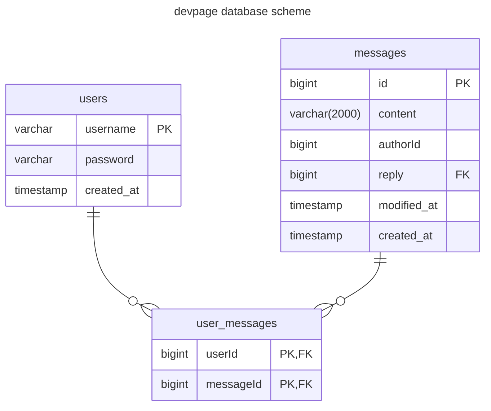
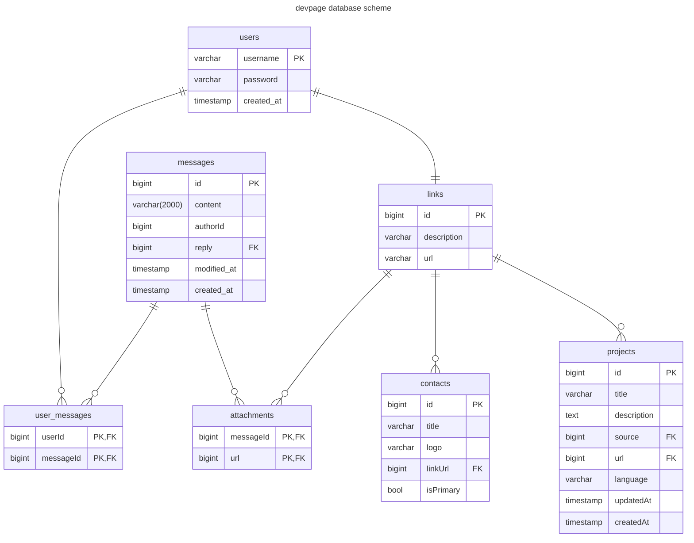

# devback

Бекэнд написанный на фреймворке gin

## endpoints

- `/` GET
- `/messages` GET
- `/message` POST
- `/user/login` POST
- `/user/register` POST

## Текущая схема бд

## Запланированная схема бд

