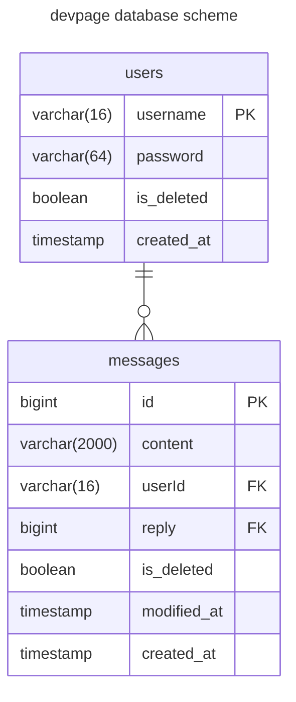
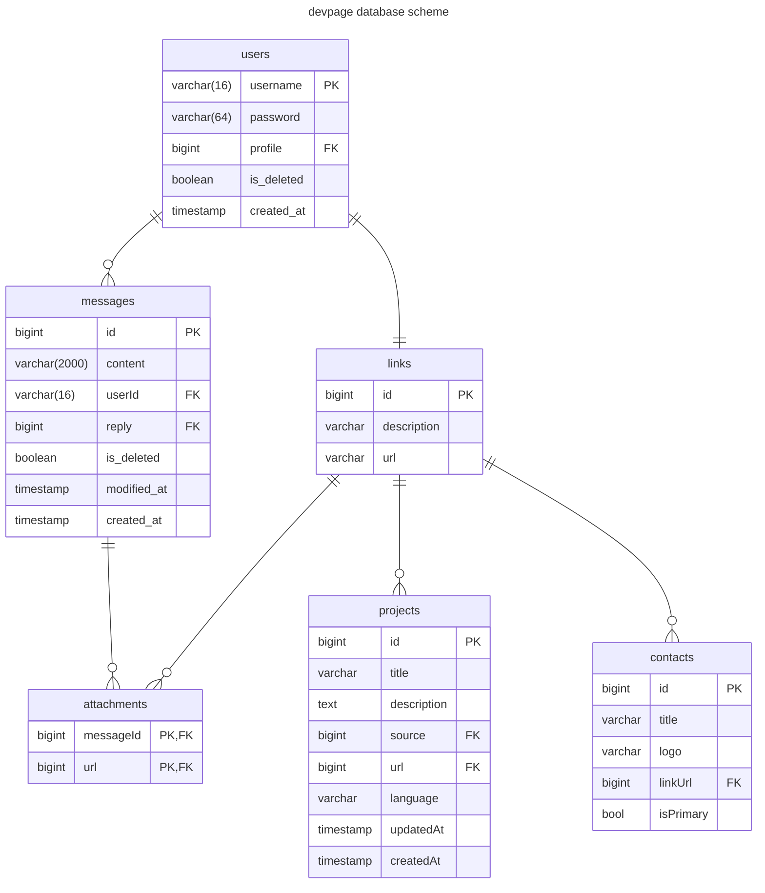

# devback

Бекэнд написанный на фреймворке gin

## endpoints

- `/` GET
- `/api/v1/messages` GET
- `/api/v1/user/login` POST
- `/api/v1/user/register` POST
- `/api/v1/user/delete` POST
- `/api/v1/user/message` POST
- `/api/v1/user/message/:id` PATCH, DELETE
- `/api/v1/<admin path>/user/message/:id` PATCH, DELETE
- `/api/v1/<admin path>/user/message/:id/permanently` DELETE
- `/api/v1/<admin path>/user/message/:id/restore` POST
- `/api/v1/<admin path>/user/:username` DELETE
- `/api/v1/<admin path>/user/:username/permanently` DELETE
- `/api/v1/<admin path>/user/:username/restore` POST

## Текущая схема бд

## Запланированная схема бд

