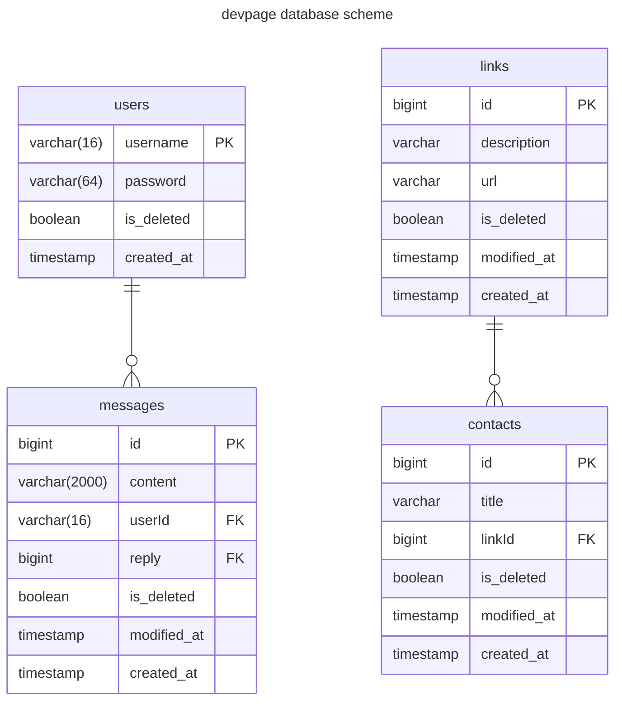
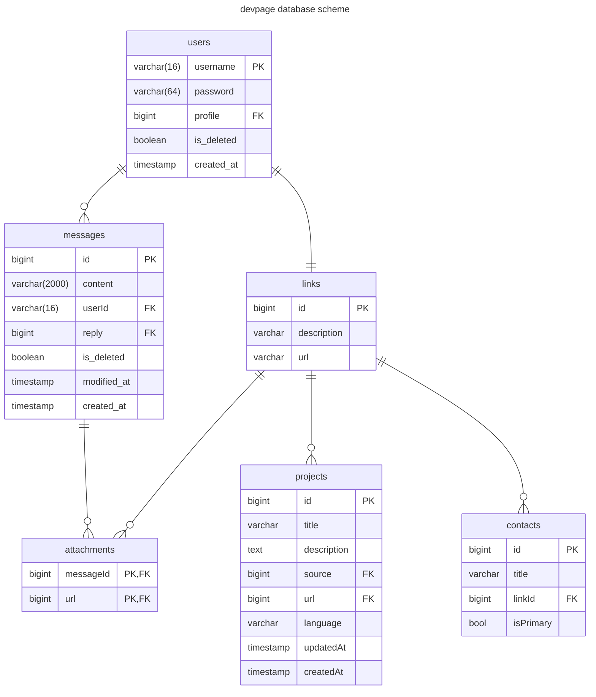

# devback

Бекэнд написанный на фреймворке gin

---

## endpoints

- `/` GET
- `api/v1/ping` GET
- `/api/v1/messages` GET
- `/api/v1/contacts` GET
- `/api/v1/contacts/:id` GET
- `/api/v1/users/login` POST
- `/api/v1/users/register` POST
- `/api/v1/users/delete` POST
- `/api/v1/users/message` POST
- `/api/v1/users/message/:id` PATCH, DELETE
- `/api/v1/<admin path>/users/messages/:id` PATCH, DELETE
- `/api/v1/<admin path>/users/messages/:id/permanently` DELETE
- `/api/v1/<admin path>/users/messages/:id/restore` POST
- `/api/v1/<admin path>/users/:username` DELETE
- `/api/v1/<admin path>/users/:username/permanently` DELETE
- `/api/v1/<admin path>/users/:username/restore` POST
- `/api/v1/<admin path>/links` GET, POST
- `/api/v1/<admin path>/links/:id` GET, DELETE
- `/api/v1/<admin path>/links/:id/permanently` DELETE
- `/api/v1/<admin path>/links/:id/restore` POST
- `/api/v1/<admin path>/contacts` POST

## Текущая схема бд

## Запланированная схема бд

## Todo

- [ ] добавить PATCH для links
- [ ] добавить в find для юзера modified_at и мигрировать
- [ ] добавить остальные методы для contacts
- [ ] добавить уведомления по e-mail, хотя бы для админа
  - [ ] добавить возможность смены пароля пользователям
- [ ] добавить сущности user новый атрибут profile FK links(id)